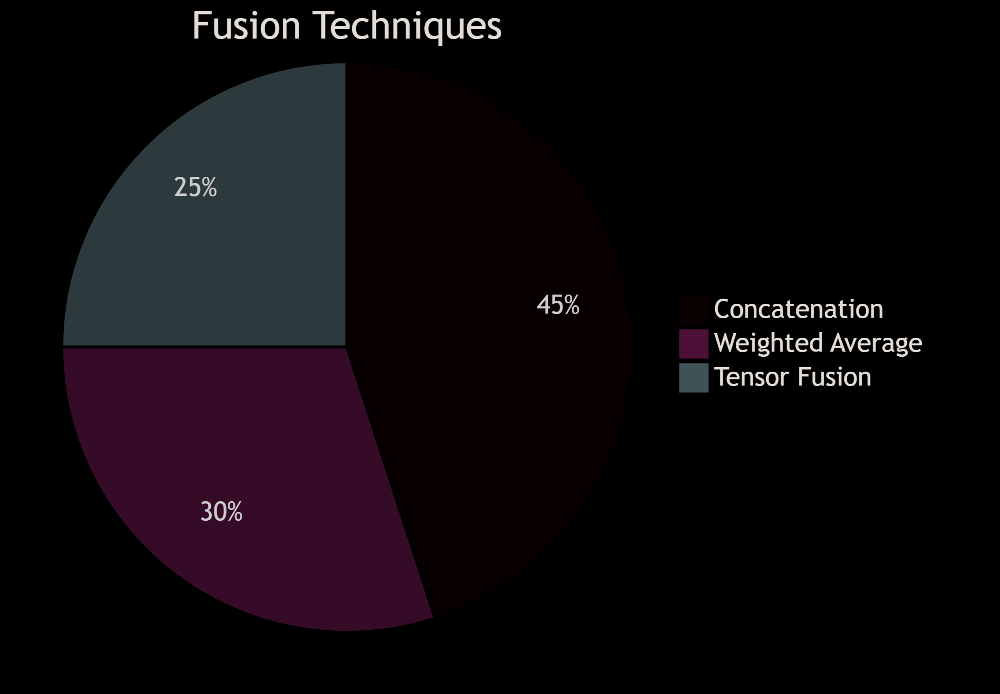
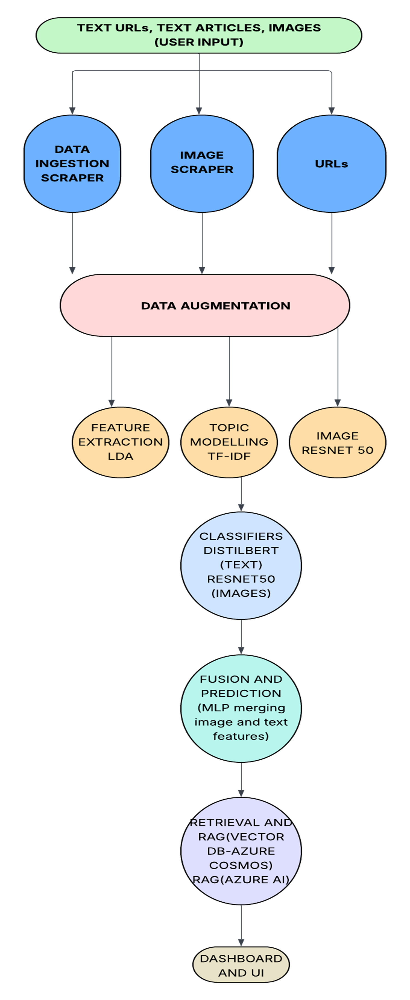

# InfoCrucible - The Multimodal Fake Information Detector  

*Advanced Deep Learning System for Detecting Misinformation and Disinformation Across Multiple Modalities*

## Overview
**InfoCrucible** is a state-of-the-art deep learning system designed to detect both **misinformation** (unintentional spread of inaccurate content) and **disinformation** (deliberate spread of false information) across multiple modalities including text, images, audio, and video. By analyzing cross-modal contradictions and contextual features, it identifies subtle inconsistencies that indicate synthetic or manipulated content.

## Key Features
- **Multimodal Fusion Architecture**: Combines embeddings from text, images, audio, and video
- **Cross-Modal Attention**: Detects inconsistencies between modalities (e.g., image-text mismatch)
- **Sentiment Integration**: Augments analysis with sentiment scores for text/audio
- **Noise-Robust Pipelines**: Tailored preprocessing for each modality
- **Deepfake Detection**: Identifies synthetic media through temporal analysis
- **Real-Time Analysis**: Optimized for efficient processing of multimedia content

## Technical Architecture

### End-to-End Processing Pipeline
### COMPLETE SOLUTION-
Data Ingestion covers both URL scraping (Phase 1) and direct article downloads (Phase 2).
 
Data Augmentation implements the Bag of Words pseudo fake augmentation using cosine similarity (Phase 2 & 3).
 
Topic Modeling (Phase 4) uses LDA to assign a topic category field.
 
Feature Extraction splits into text (TF IDF, embeddings for DistilBERT) and image (deepfake/detection features via ResNet 50).
 
Classifiers (Phase 5–7) include both classical ML (DT, NB, LR, KNN) and deep learning models.
  
Retrieval & RAG uses Cosmos DB’s vector search (thread detection) and Azure OpenAI for RAG-based real-time fact checking.
 
Dashboard & API is your React frontend + serverless Azure Functions (for real-time link/file checks).

## Contact
For project inquiries and support:

Project Lead: Khushi Singh

Email: khushisingh82072@gmail.com

Discussion Forum: GitHub Discussions

Issue Tracker: GitHub Issues